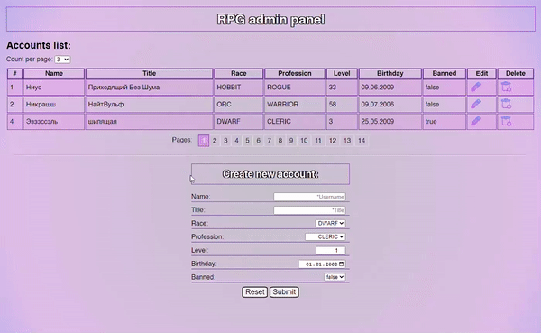

# frontend-introduction
My task was to create a simple frontend admin-panel using **JS, HTML, CSS and jQuery** for a finished backend project.

I got basic knowledge of how JavaScript works and how frontend interact with backend.
I also had to deal with html and css for interactive visualization of the table.
# How it works


# Steps to Setup
1. Clone the application

```bash
git clone https://github.com/nikita-shamrai/frontend-introduction.git
```
2. **Add TomCat** configuration
